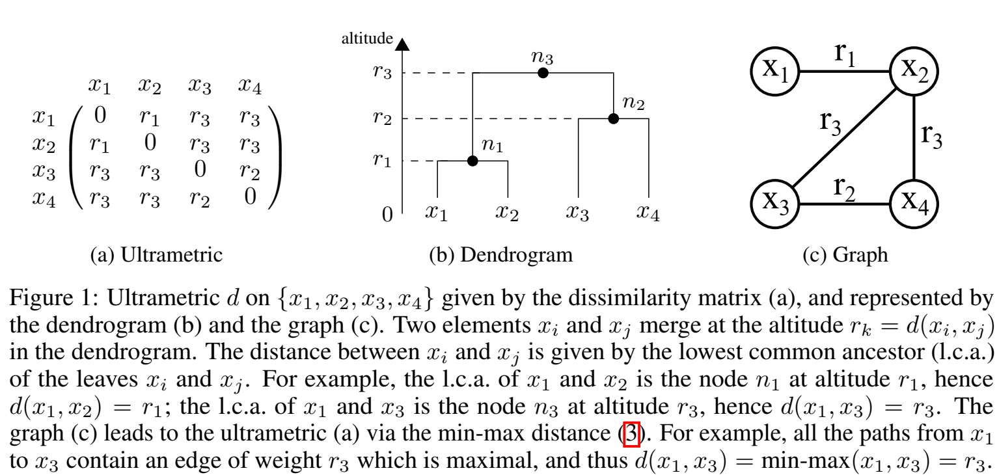
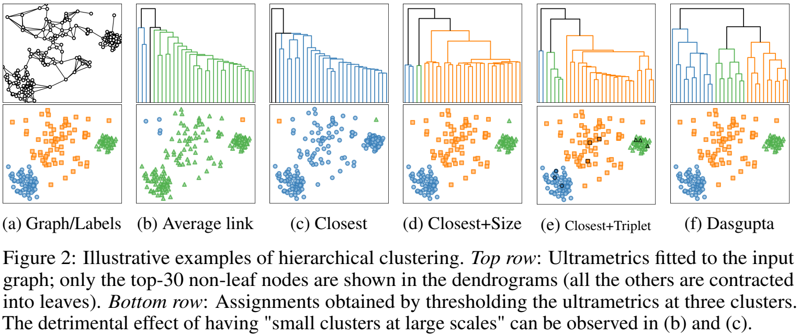
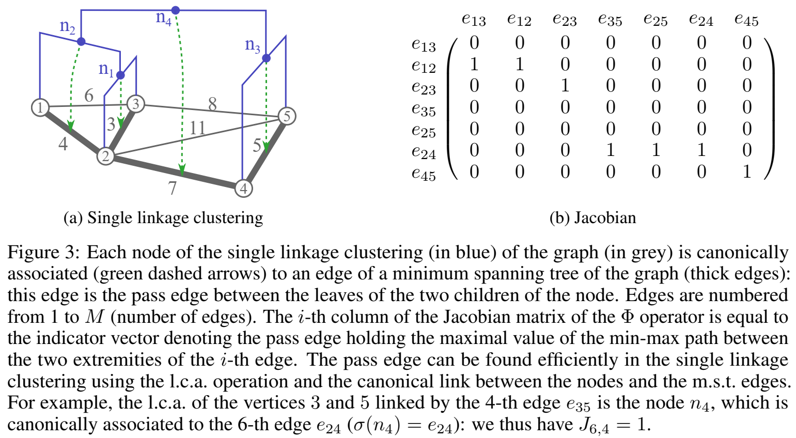
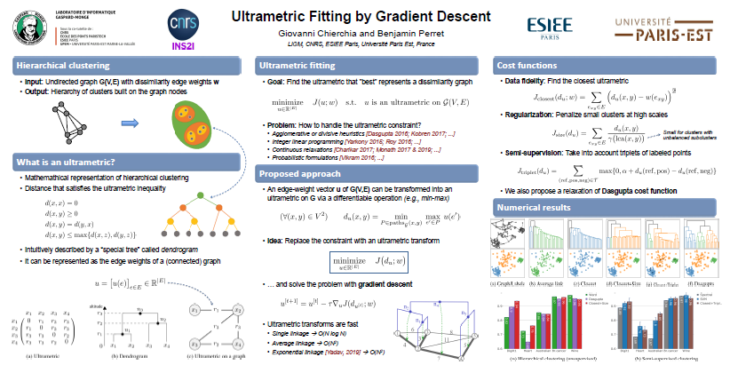

# Ultrametric Fitting by Gradient Descent

Python implementation of [Ultrametric Fitting by Gradient Descent](https://arxiv.org/abs/1905.10566) published at NeurIPS 2019.

## Abstract

We study the problem of fitting an ultrametric distance to a dissimilarity graph in the context of hierarchical cluster analysis. Standard hierarchical clustering methods are specified procedurally, rather than in terms of the cost function to be optimized. We aim to overcome this limitation by presenting a general optimization framework for ultrametric fitting. Our approach consists of modeling the latter as a constrained optimization problem over the continuous space of ultrametrics. So doing, we can leverage the simple, yet effective, idea of replacing the ultrametric constraint with an equivalent min-max operation injected directly into the cost function. The proposed reformulation leads to an unconstrained optimization problem that can be efficiently solved by gradient descent methods. The flexibility of our framework allows us to investigate several cost functions, following the classic paradigm of combining a data fidelity term with a regularization. While we provide no theoretical guarantee to find the global optimum, the numerical results obtained over a number of synthetic and real datasets demonstrate the good performance of our approach with respect to state-of-the-art agglomerative algorithms. This makes us believe that the proposed framework sheds new light on the way to design a new generation of hierarchical clustering methods.

## Illustrations

---

---

## Poster

## Usage

Download this repository and follow the two demonstration notebooks: [Clustering](https://github.com/PerretB/ultrametric-fitting/blob/master/Clustering.ipynb) and [Closest ultrametric on region adjacency graphs](https://github.com/PerretB/ultrametric-fitting/blob/master/Region_Adjacency_Graphs.ipynb).

**Requirements**

 - Classical Python scientific packages (*numpy*, *scipy*, *scikit-learn*, *matplotlib*...)
 - [Pytorch](https://pytorch.org/get-started/locally/): the optimization engine
 - [Higra](https://github.com/higra/Higra): efficient hierarchical clustering algorithms for sparse graphs

## Authors

- [Giovanni Chierchia](https://perso.esiee.fr/~chierchg/)
- [Benjamin Perret](https://perso.esiee.fr/~perretb/)

## Licence

[Cecill-B](http://www.cecill.info/licences/Licence_CeCILL-B_V1-en.txt) fully compatible with BSD-like licenses (BSD, X11, MIT) with an attribution requirement

## How to cite

	G. Chierchia, B. Perret. 
	Ultrametric fitting by gradient descent.
	Advances in Neural Information Processing Systems 32,
	to appear, December 2019.
	E-print arXiv:1905.10566

**bibtex**

	@incollection{CP2019ultrametric,
		title = {Ultrametric Fitting by Gradient Descent},
		author = {Giovanni Chierchia and Benjamin Perret},
		booktitle = {Advances in Neural Information Processing Systems 32},
		publisher = {},
		editor = {},
		pages = {},
		year = {2019},
		eprint={1905.10566},
		archivePrefix={arXiv},
	}

